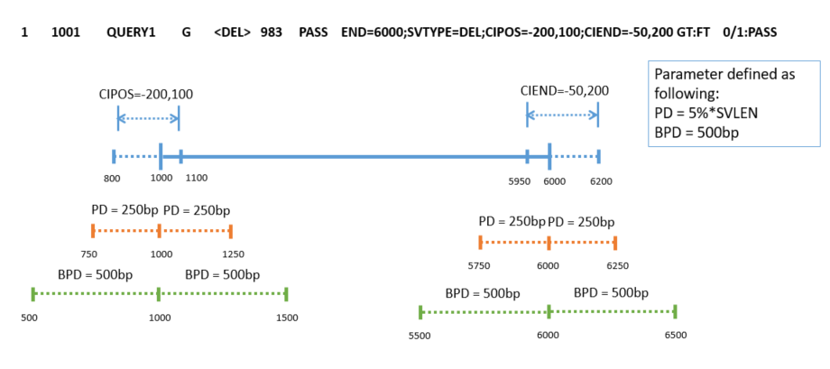
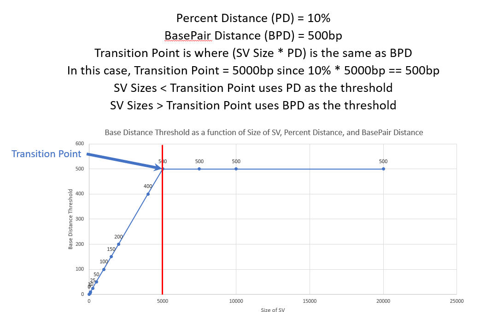
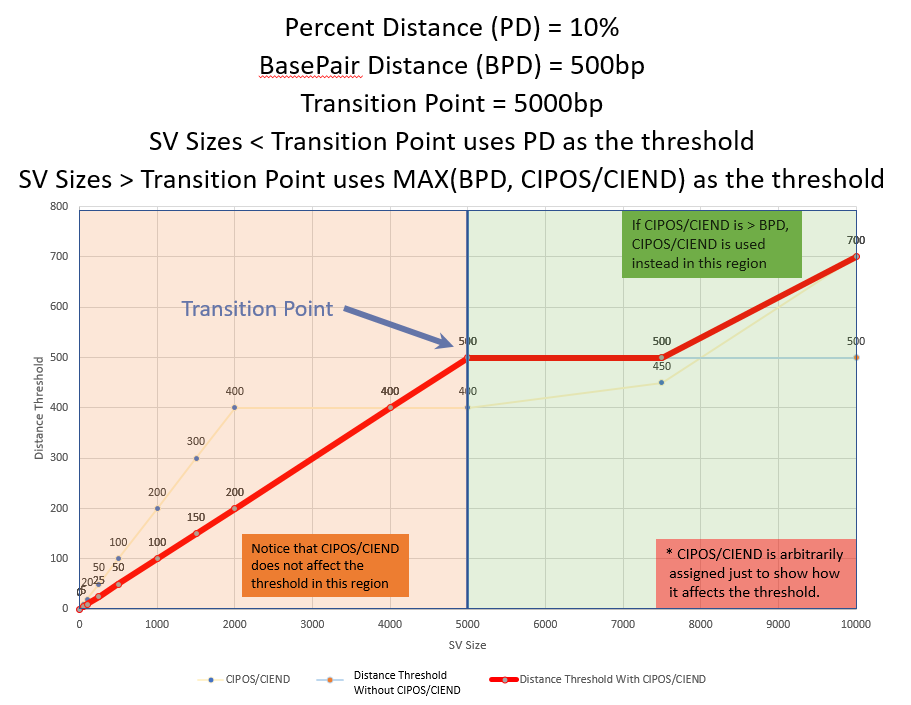
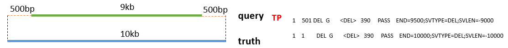
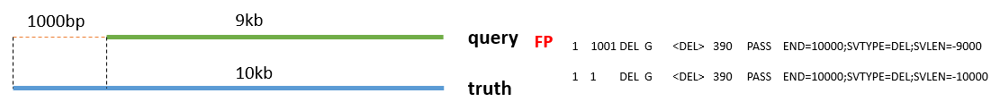

# witty.er

What is true, thank you, earnestly. A large variant evaluation tool upgraded from [wit.ty](https://git.illumina.com/DASTE/Ilmn.Das.App.Witty/blob/develop/Witty/README.md)

Developers: __[Yinan Wan](mailto:ywan@illumina.com)__, __[Kent Ho](mailto:kho@illumina.com)__

Release Notes: __[Witty.er release notes](docs/release-notes/README.md)__

<br><hr>

### Quick Start

To compare a query VCF's passing variants against a truth VCF, use the following commmand line:

```bash
dotnet Wittyer.dll -i input.vcf -t truth.vcf -o outputDir
```
<br>

## Contents

* [Design Description](#design-description)
  * [Overview](#overview)
  * [Structural Variant Comparison](#structural-variant-comparison)
    * [Deletions, Duplications and Inversions](#deletions-duplications-and-inversions)
    * [Insertions and Breakends](#insertions-and-breakends)
  * [Copy Number Variant Comparison](#copy-number-variant-comparison)
    * [Event level support](#event-level-support)
    * [Base level support](#base-level-support)
  * [Cross type matching between CNV and SV/Directional matching for CNV](#cross-type-matching-between-cnv-and-svdirectional-matching-for-cnv)
  * [Other general support](#other-general-support)
  * [Metrics](#metrics)
  * [Vcf annotation](#vcf-annotation)
* [Usage](#usage)
  * [Examples](#examples)
  * [Parameters](#parameters)
  * [Outputs](#outputs)
* [System Requirement](#system-requirement)

<br><hr><br>
## Design Description
### Overview

- Currently witty.er does SV comparison on a per-type basis, and only supports the following SV types:<br>
  > Deletions (DEL), Insertions (INS), Duplications (DUP), Inversions (INV), Translocation-Breakends (BND), and Copy Number Variants (CNV)
  
  > Witty.er requires _SVTYPE_ to be specified in the vcf INFO field
- Inserted segment is not used in comparison for Insertion
  > Insertion is only considered as break point and evaluated same way as breakend
- CNVs require the CN sample tag in order to be processed.
  > CNVs' reference copy number is based on the GT tag. e.g. if it's 0/1 (diploid), reference copy is assumed to be 2.
  
  > CNV entries without GT is assumed to be diploid.
- Complex type comparisons are currently not supported (e.g insertions in a deletion)
- Limited support for Multi-allelic entries due to vcf annotation is overly complicated
  > Multi-alts with different _SVTYPEs_ are annotated as _NotAssessed(N)_ and completely left out from stats
  
  > For multi-alt CNV gains, witty.er currently only using total _CN_ for evalutation disregard CN number of individual ALT.
- Only paired Breakends are supported (single or triple, etc. breakends are not supported)
- Refcall samples are not evaluated (samples with GT of 0/0, 0, or 0|0, etc)
- By default Genotypes match is required in order to be considered as TP.
- For witty.er to ignore genotype information, use _simpleCounting_ evaluationMode by specifying _-em_ _sc_
- By default witty.er only takes _PASS_ filter entries, for multi-sample vcf, if sample tag _FT_ exist, it has to be _PASS_ as well. (Can be configured in cmd)


### Structural Variant Comparison
#### Deletions, Duplications and Inversions

- The evaluation criteria of Deletions, Duplications and Inversions are controlled by following factors. 
   - Percentage distance (PD) - The distance between both boundaries should respect a number that's proportional to total SV length.
      - This is a distance defined by percentage of the variant length (by default 5%, so a 5kb DEL the distance cutoff is 250bp)
   - Basepair distance boundary (BPD) - By default 500bp 
   - CIPOS/CIEND 
- For the ultimate boundary distance, the cutoff is defined in two different ways based on SV length 
  - When PD < BPD (so if we use default parameter, the transition point is 10kb)
    - The cutoff for boundary distance is strictly PD
  - When PD > BPD
    - The cutoff for boundary distance is the merged interval of CIPOS/CIEND and BPD 
    - This is the same as how we evaluate breakend in the [wit.ty](https://git.illumina.com/DASTE/Ilmn.Das.App.Witty/blob/develop/Witty/README.md#detailed-implementation)
  - A typical example of what it meant by PD and BPD
  
    
- In general, the cutoff trend will look like this: 

__note this is not using default parameter__
  - Without CIPOS/CIEND:
 
  
  - Including CIPOS/CIEND:

    

- Real examples:
  - A typical TP variant
    
  - A query that was considered as TP in wit.ty but is now considered as FP in witty.er:
    

#### Insertions and Breakends
Insertion, Inversion and Breakend are all going to be interpreted as breakend when doing evaluation, note the comparison is still within type (so Insertion always compare with only Insertion). Stats are also reported by SV type. 

- __Breakends__<br>
Breakend is using the same acceptance criteria as [DEL/DUP](#deletions-duplications-and-inversions), to be noticed, PD will be based on the distance between two breakends:
  - Intra-chromosome breakend:<br>
  In the following example, with default settings PD = (2001-1)*5%=100
```
1       1 TRUTH_BND1   G       [1:2001[G   10    PASS        SVTYPE=BND
```
  - For inter-chromosome breakend, PD is assumed to be infinite, so BPD/CIPOS/CIEND is always used.
  - Two BND entries (one breakend pair) is considered as TP of 1
  - If genotype matching turned on, genotype of the interpreted breakend pair has to match
  - IntraChromosomal Breakend stats will now be binned by the distance between two breakend in a pair. 
  - Translocation Breakend will be in their own category with no bins.

- __Insertions__<br>
Insertion is interpret as a pair of breakend for evaluation.

  - PD does not apply to Insertion (can consider it as infinite as well)
  - Other evaluation criteria is the same as evaluating breakend.
  - Inserted segment currently is not taken into consideration.
  - Like Intrachromosomal Breakends, Insertions will be binned, though it'll be based on Insertion size/SVLEN.
    - Insertions of unknown size will always fall into the largest bin.

### Copy Number Variant Comparison
#### Event level support

- Event overlapping will use the same way as [DEL/DUP](#deletions-duplications-and-inversions) evaluation.
  - Evaluation criteria is percentage distance (5% by default) or basepair distance (500bp by default) depending on the SV size (see above explanations)
- Additional evaluation criteria includes 
  - CN sample tag match (cross type would be directional match)
  - By default GT has to match (turn on simpleCounting mode _--em_ _sc_ to ignore GT match)

#### Base level support
- Base level stats does not take event-level true or false into consideration
- All bases overlapped and considered true (i.e. same CN/GT, etc) is considered TP
- All bases overlapped and considered false (i.e. different CN or GT, etc) is considered FP
- All bases that are not overlapped, but is present in truth is considered FN
- All bases that are not overlapped, but is present in query is considered FP
- All bases that are not in Truth or Query will __NOT__ be assessed and not included in any stats
- Base level overlap for each entry will be reported in each vcf entry (WOW tag, see below), regardless if the event is True or False

### Cross type matching between CNV and SV/Directional matching for CNV
- Turned on my using "_-em_ _cts_" (EvaluationMode CrossTypeAndSimpleCounting)
- GAIN will be treated as DUP and LOSS will be treated as DEL, evaluation process is thus the same as [DEL/DUP](#deletions-duplications-and-inversions) evaluation.
- The stats will be reported under "Deletion" and "Duplication" section.
- When _--crossMatching_ mode is turned on, CNV gain stats will be merged with other DUP stats and CNV loss stats will be merged with DEL stats.

__Note__:
  - Cross type will only be performed under simple counting mode, due to the fact cross type is directional stats (anything above reference CN number is DUP) and the CN number for SV DUP is not present. 
  - For cross type matching, we do not support the situation of multi-allellic CNV with at least one DEL and one DUP, due to the fact merging wittyer vcf annotation tags are over complicated.

### Other general support
- Per sample, per svtype, per size category stats will be generated as a json file
- Include/Exclude filters will be supported
- Genotype matching is on by default, but can be turned off
- Annotated vcf will be provided

### Metrics
- Stats will be reported in json format
- Reported as per sample pair, per variant type, per bin
  - There will be overall event and base level stats for the sample pair (across all variant types) and for each variant type (across all bins)
    - __IMPORTANT NOTE:__ Because entries from different variant types and different bins can overlap positional coordinates, the base-level stat totals may not add up to the overall stats
      - OverallStats are the accurate stats to use for things like callability, deriving these stats by adding the numbers will result in overestimations.
  - Stats for Insertions and Breakends that are within the same chromosome (IntraChromosomalBreakends) __ARE__ binned.
  - Stats for Breakends that connect two chromosomes (aka TranslocationBreakends) are not binned.
- Insertions, Inversions and IntraChromosomalBreakends will only have event level stats reported
- Deletion, Duplication, and CopyNumberVariant types will have both event and base level stats reported
- Example:
```
{
          "VariantType": "Cnv",
          "OverallStats": [
            {
                "StatsType": "Event",
                "TruthTpCount": 0,
                "TruthFnCount": 89,
                "TruthTotalCount": 89,
                "Recall": 0.0,
                "QueryTpCount": 0,
                "QueryFpCount": 138,
                "QueryTotalCount": 138,
                "Precision": 0.0
            },
            {
                "StatsType": "Base",
                "TruthTpCount": 0,
                "TruthFnCount": 151822,
                "TruthTotalCount": 151822,
                "Recall": 0.0,
                "QueryTpCount": 0,
                "QueryFpCount": 113471,
                "QueryTotalCount": 113471,
                "Precision": 0.0
            }
          ],
          "PerBinStats": [
            {
              "Bin": "[1, 10000)",
              "BasicStats": [
                {
                  "StatsType": "Event",
                  "TruthTpCount": 0,
                  "TruthFnCount": 0,
                  "TruthTotalCount": 0,
                  "Recall": "NaN",
                  "QueryTpCount": 0,
                  "QueryFpCount": 0,
                  "QueryTotalCount": 0,
                  "Precision": "NaN"
                },
                {
                  "StatsType": "Base",
                  "TruthTpCount": 0,
                  "TruthFnCount": 0,
                  "TruthTotalCount": 0,
                  "Recall": "NaN",
                  "QueryTpCount": 0,
                  "QueryFpCount": 0,
                  "QueryTotalCount": 0,
                  "Precision": "NaN"
                }
              ]
            },           
            {
              "Bin": "10000+",
              "BasicStats": [
                {
                  "StatsType": "Event",
                  "TruthTpCount": 0,
                  "TruthFnCount": 89,
                  "TruthTotalCount": 89,
                  "Recall": 0.0,
                  "QueryTpCount": 0,
                  "QueryFpCount": 138,
                  "QueryTotalCount": 138,
                  "Precision": 0.0
                },
                {
                  "StatsType": "Base",
                  "TruthTpCount": 0,
                  "TruthFnCount": 151822,
                  "TruthTotalCount": 151822,
                  "Recall": 0.0,
                  "QueryTpCount": 0,
                  "QueryFpCount": 113471,
                  "QueryTotalCount": 113471,
                  "Precision": 0.0
                }
              ]
            }
          ]
        }
```

### Vcf annotation

- Example vcf lines:
```
1       1 TRUTH1   N       <CN0>   4.56    PASS        SVTYPE=CNV;END=20000;CNVLEN=20000;CIPOS=0,400;CIEND=-800,1200     GT:CN:WHAT:WIT:WHY:WOW:WHO:WIN:WHERE      .:.:.:.:.:.:.:.:.  0/1:1:am:FP:Multiple:100,19800|19900,200000:QUERY1,QUERY2:CNV|10000-49999:50|300|500|700,19850|19200|1300|500
  
1       101 QUERY1   N       <CN0>   4.56    PASS        SVTYPE=CNV;END=19800;CNVLEN=19200;CIPOS=-50,600;CIEND=-100,700     GT:CN:WHAT:WIT:WHY:WOW:WHO:WIN:WHERE          1/1:0:am:FP:GTmismatch:101,19800:TRUTH1:CNV|10000-49999:50|300|500|700  .:.:.:.:.:.:.:.:.
1       19901 QUERY2   N       <CN0>   4.56    PASS        SVTYPE=CNV;END=21000;CNVLEN=1100     GT:CN:WHAT:WIT:WHY:WOW:WHO:WIN:WHERE          0/1:1:lm:FP:FailedBoundary:19901,20000:TRUTH1:CNV|1000-10000:19850|19200|1300|500   .:.:.:.:.:.:.:.:.
```

- Witty.er provides following tags for annotation purpose:
  - __WHAT__ for top ten matches (or less if there are less matches)
  - __WIT__ for witty.er decision based on the best match. Potential values are (TP/FP/FN/N). N means not assessed.
  - __WHY__ as an extension of WIT to explain reasons for FP and N.
  - __WOW__ witty.er overlap window of DEL/DUP/CNV to support base level stats
  - __WHERE__ A list of border distances, which consist of four numbers separated by pipes (|) describing the boundary distances between the entry and the match
  - __WHO__ A list of IDs representing the top ten matching events (could be less if there are less matches) in the same order as WHAT and WHERE.
  - __WIN__ Additional match status information for stratification (e.g. INS|1-999 or INS|1000-9999 or BND, which has no bins).
- Detailed vcf spec can be found [here](https://confluence.illumina.com/pages/viewpage.action?pageId=201077378#Proposedwit.tyupgrade(akawitty.er)-Detailedvcfspec)


## Usage
### Examples
- Turn on simple counting mode
```bash
## for multi-sample vcf, if either or both vcfs are multi-sample, sample pair information is required.  If -sp not present, it means to just compare the first columns
## to compare truthA with queryA and truthB with queryB
dotnet Wittyer.dll -i input.vcf -t truth.vcf -o outputDir -em sc -sp truthA:queryA,truthB:queryB

## to compare truthA with queryA, you could leave out truthA:queryA from the parameters
dotnet Wittyer.dll -i input.vcf -t truth.vcf -o outputDir -em sc
```

- Turn on cross-type matching mode (will be forced to be simpleCounting, see [here](#cross-type-matching-between-cnv-and-svdirectional-matching-for-cnv))
```bash
dotnet Wittyer.dll -i input.vcf -t truth.vcf -o outputDir -em cts
```

- Only consider query entry to be TP when it is 100% overlap with truth entry.
```bash
dotnet Wittyer.dll -i input.vcf -t truth.vcf --po 1.0 --bpd 0 -o outputDir
```

- Update the overlap interval for Breakend to be 100 to be consider as truth
```bash
dotnet Wittyer.dll -i input.vcf -t truth.vcf --bpd 100
```

- Cacluate total stats for all entries (PASS and non-PASS filter entries) with no binning performed
```bash
dotnet Wittyer.dll -i input.vcf -t truth.vcf --bs 0 --if
```

- Calculate stats for entries with  L10kb filters
```bash
dotnet Wittyer.dll -i input.vcf -t truth.vcf --if L10kb
```

- Calculate stats for entries with L10kb filters, but NOT with LowGQX filter
```bash
dotnet Wittyer.dll -i input.vcf -t truth.vcf --if L10kb -ef LowGQX
```

### Parameters
__Required parameters__:

>  __-i, --inputVcf=VALUE__<br>
>  Query vcf file (only support one file for now)<br>
  __-t, --truthVcf=VALUE__<br>
Truth vcf file (currently only support one file)

__Other Parameter__

>__--bpd, --bpDistance=VALUE__ <br>
         Upper bound of boundary distance when comparing truth and query. 
         By default is 500bp.

>__--pd, --percentDistance=VALUE__<br>
        In order to consider truth and query to be the
        same, the distance between both boundaries
        should be within a number that's proportional
        to total SV length.  Input this as a decimal,
        by default is 0.05.

>__--bs, --binSizes=VALUE__<br> 
        Comma separated list of bin sizes. Default is
        1000, 10000 which means there are 3 bins: [1,
        1000), [1000,10000), [10000, >10000)

>__--if, --includedFilters=VALUE__<br>
        Comma separated list. Only variants contain these
        filters will be considered. by default is PASS

>__--ef, --excludedFilters=VALUE__<br>
        Comma separated list. Variants with any of these
        filters will be excluded in comparison. If any
        variants have filters conflicting with those in
        the Included filters, excluded filters will
        take the previlege.

>__-o, --outputDirectory=VALUE__<br>
        Directory where all output files located

>__--sp, --samplePair=VALUE__<br>
        Optional unless either or both query and truth
        vcfs have more than one sample column.Comma
        separated list of truth to query sample
        mappings using colon (:) as the delimiter. For
        convenience, if you just want the first column
        compared, you can just provide this option with
        empty contents instead.For example, Truth1:
        Query1,NA12878:NA1278_S1

>__--em, --evaluationMode=VALUE__<br>
        Choose your evaluation mode, options are 'Default'('d')
        , 'SimpleCounting'('sc'), '
        CrossTypeAndSimpleCounting'('cts'), by default it'
        s using 'Default' mode, which does comparison
        by SvType and requires genotyping match

>__-v, --version__<br>
        witty.er version information

>__-h, --help__<br>
        Show this message and exit

### Outputs
Currently witty.er provides:
- An overall per-sample-pair stats summary.
An example of overall stats summary from stdout:

```
Overall Stats:
Overall Precision: 19.471 %
Overall Recall: 78.768 %
--------------------------------
QuerySample     TruthSample     QueryTotal      QueryTp QueryFp Precision       TruthTotal      TruthTp TruthFn Recall

NA12877 CephFather-12877        10091   1992    8099    19.7%       2550    1997    553 78.3%
NA12878 CephMother-12878        10422   2002    8420    19.2%       2532    2006    526 79.2%
```
- A Wittyer.stats.json with detailed per-sample-pair, per-svtype, per-bin stats, example [here](#metrics)

- Additional vcf file for each sample pair, with updated query and truth entries merged into one file, the sample columns are organized as TRUTH then QUERY, detailed vcf spec [here](#vcf-annotation)

## System Requirement
* witty.er is built using C# dotnet core 2.0 framework.<br>
* This repo can be cloned and compiled using MS Build or run directly with dotnet.<br>
* To run in MS Windows or linux, just call dotnet Wittyer.dll.<br>
